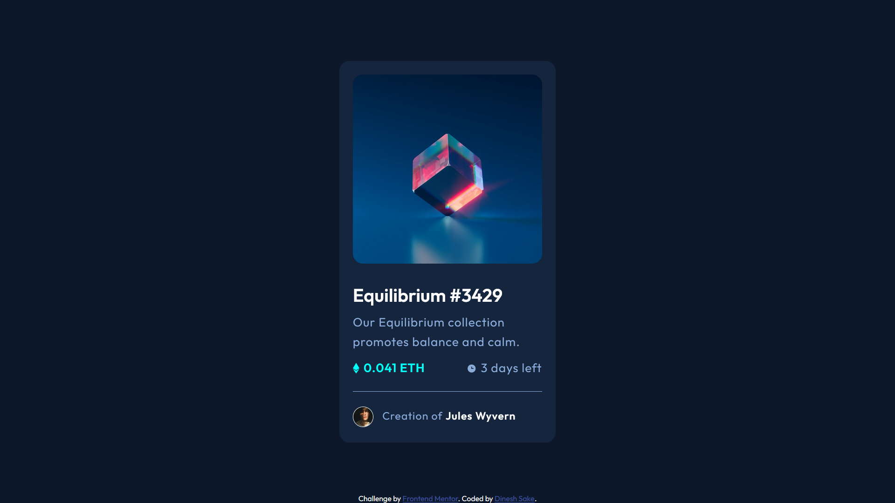

# Frontend Mentor - NFT preview card component solution

This is a solution to the [NFT preview card component challenge on Frontend Mentor](https://www.frontendmentor.io/challenges/nft-preview-card-component-SbdUL_w0U). Frontend Mentor challenges help you improve your coding skills by building realistic projects. 

## Table of contents

- [Overview](#overview)
  - [The challenge](#the-challenge)
  - [Screenshot](#screenshot)
  - [Links](#links)
- [My process](#my-process)
  - [Built with](#built-with)
  - [What I learned](#what-i-learned)
  - [Continued development](#continued-development)
  - [Useful resources](#useful-resources)
- [Author](#author)
- [Acknowledgments](#acknowledgments)

## Overview

### The challenge

Users should be able to:

- View the optimal layout depending on their device's screen size
- See hover states for interactive elements

### Screenshot



### Links

- Solution URL: [Check the code](https://github.com/Nrupatungan/nft-card)
- Live Site URL: [Visit site](https://nrupatungan.github.io/nft-card/)

## My process

### Built with

- Semantic HTML5 markup
- CSS animation
- Responisive Design
- Flexbox
- Mobile-first workflow

### What I learned

I learned how to add a hovering image on top of an existing image and I learned about CSS properties like z-indes, position, cursor etc.

```css
.hover-section{
    position: relative;
}

.hover-section span{
    position: absolute;
    top: 0;
    bottom: 0;
    right: 0;
    left: 0;
    width: 100%;
    height: 15.555555555555555555555555555556rem;
    z-index: 100;
    cursor: pointer;
    border-radius: 0.8333rem;
    transition: background-color 0.25s ease;
}

.hover-section span:hover{
    background: transparent url(./images/icon-view.svg) no-repeat;
    background-position: center;
    background-color:hsla(178, 100%, 50%, 0.2);
    border-radius: 0.833rem;
}
```

If you want more help with writing markdown, we'd recommend checking out [The Markdown Guide](https://www.markdownguide.org/) to learn more.

### Continued development

I'd love to improve in certain areas like animation, parallax images, grid layout, responsive design, semantic html and more.

### Useful resources

- [Example resource 1](https://www.example.com) - This helped me for XYZ reason. I really liked this pattern and will use it going forward.
- [Example resource 2](https://www.example.com) - This is an amazing article which helped me finally understand XYZ. I'd recommend it to anyone still learning this concept.

## Author

- Website - Ain't got any as of now.
- Frontend Mentor - [@Dinesh_Sake](https://www.frontendmentor.io/profile/Nrupatungan)
- GitHub - [@Dinesh_Sake](https://github.com/Nrupatungan/)

## Acknowledgments

Me and my mate worked on this project from FrontEnd Mentor as our first challenge, in order to understand the basic nuances that go behind the implemenation of various CSS components and rules.
